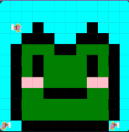

# unit-1-asphalt-project
# Unit 1 - Asphalt Art

## Introduction

Cities use asphalt art to improve public safety, inspire their residents and visitors, and brighten communities. Your goal is to create asphalt art to revitalize The Neighborhood and bring the community together with the help of the Painter.

## Requirements

Use your knowledge of object-oriented programming, algorithms, the problem solving process, and decomposition strategies to create asphalt art:
- **Create a new subclass** – Create at least one new subclass of the PainterPlus class that is used for a component of the asphalt art design.
- **Plan an algorithm** – Use the problem solving process and decomposition strategies to plan an algorithm that incorporates a combination of sequencing, selection, and/or iteration.
- **Write a method** – Write at least one method in a PainterPlus subclass that contributes to a component of the asphalt art design.
- **Document your code** – Use comments to explain the purpose of the methods and code segments.

## Notes: Neighborhood & Painter Class

This project was created on Code.org's JavaLab platform using the built-in Neighborhood GUI output. To test and edit this project you must build in Code.org's JavaLab with the Neighborhood GUI enabled. For reference to the Painter class documentation, [you can read more here.](https://studio.code.org/docs/ide/javalab/classes/Painter)

## Output:

## Reflection

1. Describe your project.

For my project I made a very simple frog face coming out the water.

2. What are two things about your project that you are proud of?

Two things I am most proud of is my final result, I had to picture I wanted to resemble and at the end it looked very similar. Another thing I am proud of is I figurede out how to do certain codes to finish my project.

3. Describe something you would improve or do differently if you had an opportunity to change something about your project.

Something I would improve is definetely writing my code way more effiecentatly and neatly. My code is super long and sequential so next time I would like to add while loops to make it shorter.

4. How is this project related to STEAM (Science, Technology, Engineering, Art, and Mathematics)? Provide explicit examples from the project and details as possible. 

It is related to STEAM because this project uses technology like a computer. This project is art as well because you need to code the painters to paint your masterpiece. Lastly, it is very similar because it works two different things like creative design and problem solving skills.

5. What SLOs did you demonstrate during completing this project?

I demonstarted problem solving by looking at a image I found on the internet. Then I learned how to code and make it so my painters can paint that certain image. I had problems and ended up fixing it just so my image can be created.